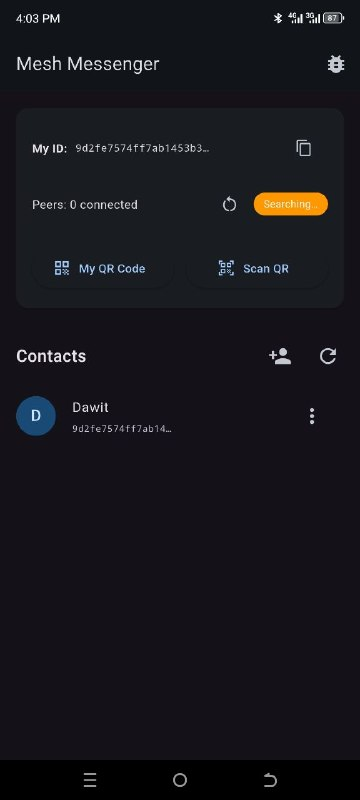

# Mesh Messenger



This project is for an offline and decentralized messaging app that I made with Flutter.
The app works without any internet or cellular connection. It uses the Google Nearby Connections API (bluetooth/wifi Direct) to automatically find nearby devices and form a peer-to-peer mesh network. Messages are transferred (while encrypted) from device to device until they reach the target.

## Current features
* **End-to-End encryption:** RSA-2048 + AES encryption. the user's public key acts as their unique ID, like a phone number.
* **Multi-hop mesh routing:** there are routing algorithms like Flooding and Gossip to pass messages
* **Delay-tolerant network:** an outbox that caches messages and automatically forwards them as new devices are found
* **QR code contacts:** add contacts by scanning their public QR code.
* **Works in the background:** runs the service to keep the mesh node active even when the app is minimized.

## Future planned features
* Admin accounts that can be used for updates/announcements etc...
* Add more routing algorithms that might be better.

## Requirements
* **Flutter SDK:** version 3.0.0 or higher
* **Android Device:** best for Android 10+

## How to build and run

1. **clone the repository and get dependencies:**
   ```bash
   git clone https://github.com/Bini-jpeg/mesh-messenger.git
   cd mesh_messenger
   flutter pub get
   ```

2. **if you want to run on a connected android device without an apk:**
   plug in your android device and run this:
   ```bash
   flutter run
   ```

3. **build an apk:**
   to build a apk that you can share and install, run this (it will take time depending on your computer):
   ```bash
   flutter build apk --release
   ```
   *the generated apk will be at:* `build/app/outputs/flutter-apk/app-release.apk`

## permissions
* **Location** is required by android to find nearby devices
* **Bluetooth & Nearby Devices** for P2P connections
* **Camera** for scanning QR codes
* **Notifications** to keep alive the background mesh service
